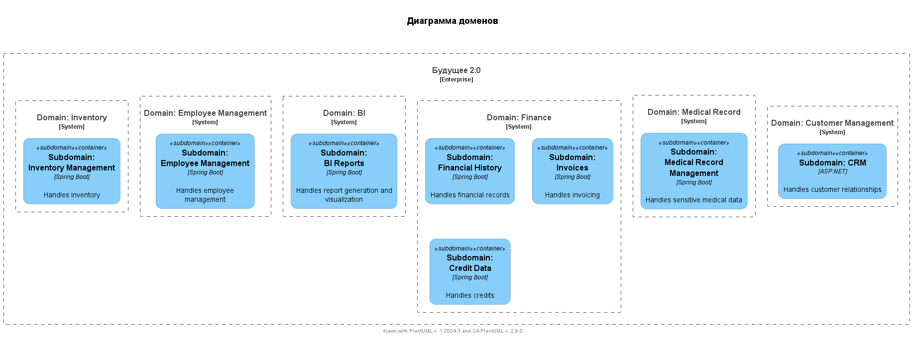

# Описание доменов

## Диаграмма доменов Будущее 2.0

## Доменная структура

### 1. **Domain: Customer Management**
**Subdomain:** CRM  
**Технология:** `ASP.NET`
**Описание:** Управляет взаимодействием с клиентами, включая хранение данных о них, историю взаимодействий и обслуживание.

### 2. **Domain: Medical Record**
**Subdomain:** Medical Record Management  
**Технология:** `ASP.NET`
**Описание:** Управление медицинскими записями, включая обработку конфиденциальной информации о здоровье клиентов. Он требует особого внимания к безопасности и соответствия нормативным требованиям.

### 3. **Domain: Finance**
Включает три поддомена, каждый из которых отвечает за различные аспекты финансовых операций:
- **Subdomain:** Financial History
  **Технология:** `ASP.NET`
  **Описание:** Управляет историей финансовых операций клиентов.

- **Subdomain:** Invoices  
  **Технология:** `ASP.NET`
  **Описание:** Отвечает за выставление счетов и управление оплатами.

- **Subdomain:** Credit Data  
  **Технология:** `ASP.NET`
  **Описание:** Обрабатывает данные о кредитах.

### 4. **Domain: BI**
**Subdomain:** BI Reports  
**Технология:** `ASP.NET`  
**Описание:** Генерирует отчёты и визуализирует данные для поддержки бизнес-аналитики.

### 5. **Domain: Employee Management**
**Subdomain:** Employee Management  
**Технология:** `ASP.NET`
**Описание:** Управляет данными сотрудников, включая профили, роли и управление доступом.

### 6. **Domain: Inventory**
**Subdomain:** Inventory Management  
**Технология:** `ASP.NET`
**Описание:** Обрабатывает данные о запасах и управляет складскими операциями.

## Обоснование разделения на домены

### 1. **Разделение ответственности**
Каждый домен выделен в отдельную область.
-> Помогает избежать дублирования логики и улучшает удобство и качество поддержки системы.

### 2. **Модульность**
Благодаря разделению на домены система становится модульной (DDD, основа для микросервисного проектирования).
-> Упрощает разработку, тестирование и внедрение новых функций.
-> Позволяет разным командам работать над отдельными доменами параллельно.

### 3. **Масштабируемость**
Каждый домен может масштабироваться независимо.
-> Эффективное использование ресурсов.
-> Адаптация к динамическим нагрузкам.

### 4. **Безопасность**
Отдельное управление поддоменами, такими как Medical Record и Finance.
-> Применение специальных политик безопасности для отдельных доменов.

### 5. **Переиспользование**
-> BI Reports могут быть переиспользованы другими системами или доменами внутри организации (новые услуги / сервисы).

